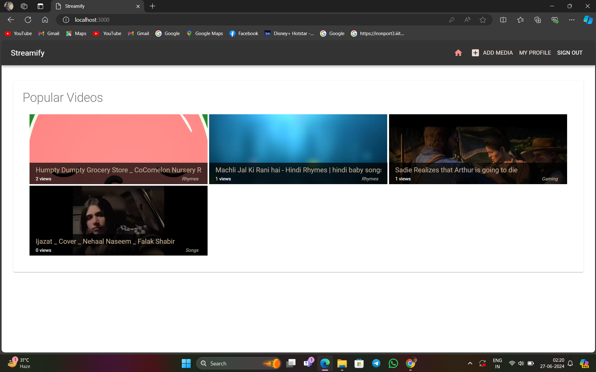

# Streamify

## Overview

**Streamify** is a modern and versatile media player built using the MERN stack (MongoDB, Express.js, React, and Node.js). It provides users with a seamless experience for streaming and managing media files.

## Features

- **User Authentication**: Secure login and signup.
- **Media Upload**: Users can upload and manage their media files.
- **Responsive Design**: Accessible on all device sizes.
- **User Profiles**: Each user has a personalized profile.
- **Popular Media**: Highlights popular media based on user interactions.
- **Real-time Updates**: Media list updates in real-time.

## Screenshots

### 1. Homepage

The homepage provides an overview of popular media and quick access to different sections of the app.

### 2. Media Player

The media player allows users to play, pause, and skip through their media files.

### 3. User Profile

The user profile page displays user information and a list of their uploaded media.

The upload media page enables users to upload new media files with ease.

## Video Demonstration

Watch a short video demonstration of **Streamify** in action:

[

## Getting Started

### Prerequisites

Ensure you have the following installed:

- [Node.js](https://nodejs.org/)
- [MongoDB](https://www.mongodb.com/)
- [Git](https://git-scm.com/)

### Installation

1. Clone the repository:

    
    git clone https://github.com/your-username/streamify.git
    cd streamify
    

2. Install dependencies for the server and client:

   npm install
   npm run development

### Usage

1. Visit `http://localhost:3000` in your browser to access the application.
2. Sign up or log in to your account.
3. Upload and manage your media files.
4. Enjoy streaming your media on **Streamify**!

## Contact

For any inquiries or support, please contact [Sandarbh Kansal](mailto:sandarbhkansal8@gmail.com) OR[Dhruv Gupta](mailto:dhruvdronzer9@gmail.com) .

---

Enjoy streaming with **Streamify**!
